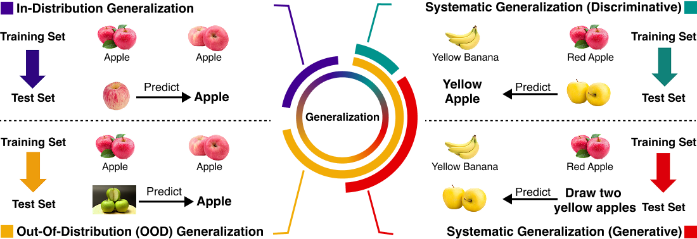

<h1 align="center">GenSG</h1>

<p align="center">
  <a href="https://arxiv.org/abs/XXXXXXX"></a>
  <a href="data/test.json"></a>
  <a href="https://github.com/BlueWhaleLab/GenSG"></a>
  <a href="LICENSE"></a>
</p>

<p align="center">
  
</p>


GenSG is a prototype benchmark for evaluating the systematic generalization (SG) capabilities of large language models (LLMs) from the generative perspective. Unlike most existing SG benchmarks that adopt a discriminative paradigm — where models parse or verify pre-constructed combinations of atomic elements — GenSG requires models to autonomously construct action sequences to achieve a high-level goal from atomic components. This generative formulation forces models to navigate an exponentially larger compositional search space ($O(N^{L_{max}})$), better reflecting real-world problem solving. The current prototype includes a resource scarcity setting as one illustrative test of systematicity; please refer to our paper for details.

Our results reveal a striking gap: **for the same model, switching from discriminative to generative evaluation causes accuracy to drop by 2–5×**(e.g., Gemini 3.1 Pro: 92% → 52%, GPT 5.4: 78% → 23%, DeepSeek V3.2: 53% → 6%), while **average output length increases by 2–4×** (e.g., GPT 5.4: 5,521 → 23,117 tokens), demonstrating that the generative task is substantially harder and demands far greater reasoning effort.


## Repository Structure

```
GenSG/
├── main_gen.py        # Generative evaluation: model generates action sequences
├── main_dis.py        # Discriminative evaluation: model infers goals from actions
├── utils/
│   ├── basics.py      # Game rules, object definitions, and prompt templates
│   ├── engine.py      # GameEngine: executes and validates game actions
│   └── validator.py   # Validator: checks solution correctness
└── data/
    └── test.json      # The GenSG dataset
```

## Setup

**1. Install dependencies**

```bash
conda create -n gensg python=3.12 -y
conda activate gensg
pip install requests tqdm loguru
```

**2. Set your API key**

```bash
export OPENROUTER_API_KEY="your-api-key-here"
```

## Running the Evaluation

### Generative Task

Evaluate how well a model generates action sequences to reach a target goal:

```bash
python main_gen.py \
  --test_data data/test.json \
  --model_name "openai/gpt-4o" \
  --start 0 \
  --end 100 \
  --concurrency 5
```

Output is saved to `Result_{model_name}_{start}_{end}.json`.

### Discriminative Task

Evaluate how well a model infers the original goal from a given action sequence:

```bash
python main_dis.py \
  --test_data data/test.json \
  --model_name "openai/gpt-4o" \
  --start 0 \
  --end 100 \
  --concurrency 5
```

Output is saved to `Discriminative_Results_{model_name}_{start}_{end}.json`.

### Arguments

| Argument | Default | Description |
|---|---|---|
| `--test_data` | `data/test.json` | Path to test data |
| `--model_name` | `minimax/minimax-m2.7` | Model ID |
| `--start` | `0` | Start index of test data |
| `--end` | (full dataset) | End index of test data |
| `--concurrency` | `5` | Number of parallel API calls |
| `--max_retries` | `3` | Retry limit per failed request |

## Results
We evaluate six state-of-the-art LLMs, including both proprietary and open-source models, on the generative and discriminative tasks. The results reveal a significant performance gap: **on the same data, switching from discriminative to generative evaluation causes accuracy to drop by 2–5×** (e.g., Gemini 3.1 Pro: 92% → 52%, GPT 5.4: 78% → 23%, DeepSeek V3.2: 53% → 6%), while **average output length increases by 2–4×** (e.g., GPT 5.4: 5,521 → 23,117 tokens, Grok 4.20: 11,497 → 28,078 tokens). This confirms that generative evaluation is substantially more challenging, requiring models to actively search through a vast compositional space rather than simply verifying predefined combinations.

| Model | Generative Accuracy | Generative Avg. Output Length | Discriminative Accuracy | Discriminative Avg. Output Length |
|---|---|---|---|---|
| GPT 5.4 | 23.00 | 23116.56 | 78.00 | 5520.57 |
| Gemini 3.1 Pro | 52.00 | 20248.39 | 92.00 | 10996.72 |
| Grok 4.20 | 13.00 | 28078.04 | 84.00 | 11497.30 |
| Claude Opus 4.6 | —† | —† | —† | —† |
| DeepSeek V3.2| 6.00 | 19209.09 | 53.00 | 17030.96 |
| MiniMax M2.7 | 2.00 | 47368.67 | 67.00 | 25364.04 |

† Results unavailable due to exceeding the model's maximum output length.

## Citation

<!-- TODO: Add citation -->

```bibtex
@article{gensg2026,
  title   = {},
  author  = {},
  journal = {},
  year    = {2026}
}
```